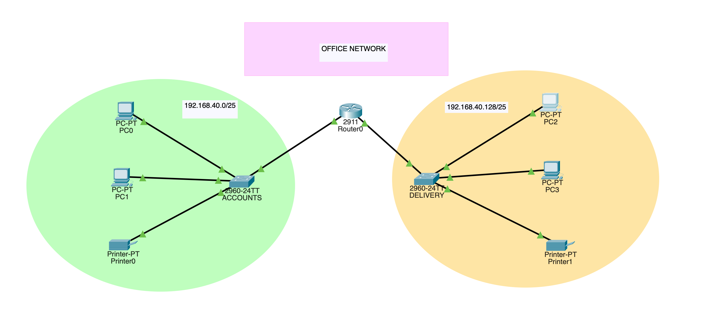
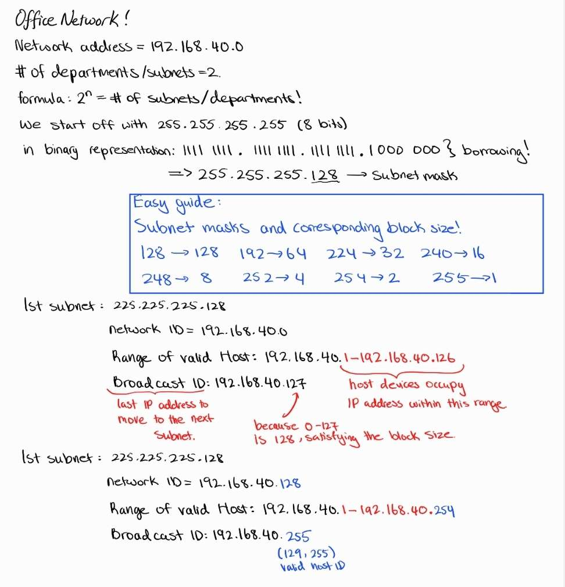

# Basic Departmental Network Design (Accounts & Delivery)

> **Version**: 1.0 (Pinned)  
> **Git Tag**: `accounts-delivery-v1.0`  
> **Status**: Completed ✓

### Objective

I designed this network to simulate a small departmental LAN environment with **segmentation between the Accounts and Delivery departments**, reflecting a real-world office setup. The project emphasizes **logical subnetting, device configuration, IP planning, and inter-departmental communication**, serving as a foundational lab to build more complex topologies.

---

## Topology Overview

This topology connects two departments—**Accounts** and **Delivery**—each with:

* **2 PCs**
* **1 printer**
* **1 switch**

A single router connects both departments using static routing and directly assigned subnets. The primary goals were:

* Efficient **use of IP space** through subnetting
* **Layer 2 separation** using individual switches
* Basic **IP configuration and connectivity testing**



---

## Design Rationale

### Device Choices

* **Router (1x):** Acts as the central gateway between both departments.
* **Switches (2x):** One per department to ensure local device switching.
* **End Devices (PCs and Printers):** Simulate real departmental environments with typical host diversity.

### Subnetting Strategy

I was given the base network: `192.168.40.0/24`. To ensure **logical separation** and future scalability, I decided to subnet this into **two /25 networks**.

| Subnet                | Network         | Subnet Mask             | Range                           | Broadcast        |
|-----------------------|-----------------|-------------------------|---------------------------------|------------------|
| Subnet A (Accounts)   | 192.168.40.0    | 255.255.255.128 (/25)   | 192.168.40.1 - 192.168.40.126   | 192.168.40.127   |
| Subnet B (Delivery)   | 192.168.40.128  | 255.255.255.128 (/25)   | 192.168.40.129 - 192.168.40.254 | 192.168.40.255   |


This provided **128 IPs per subnet**, which is sufficient for each department and allows room for growth.

Extra work for my own reference: 


### IP Allocation

Each router interface was assigned the **first usable IP** in each subnet to act as the **default gateway** for its respective VLAN:

* Router → G0/0 → `192.168.40.1` (Accounts)
* Router → G0/1 → `192.168.40.129` (Delivery)

Each PC and printer received statically assigned IPs within their subnet's valid host range.

---

## Configuration Overview

### Router (R0)

```bash
enable
configure terminal

interface gig0/0
 ip address 192.168.40.1 255.255.255.128
 no shutdown

interface gig0/1
 ip address 192.168.40.129 255.255.255.128
 no shutdown

exit
write memory
```

### PC and Printer IPs

#### Accounts Department:

| Device  | IP Address   | Subnet Mask     | Default Gateway |
| ------- | ------------ | --------------- | --------------- |
| PC0     | 192.168.40.2 | 255.255.255.128 | 192.168.40.1    |
| PC1     | 192.168.40.3 | 255.255.255.128 | 192.168.40.1    |
| Printer | 192.168.40.4 | 255.255.255.128 | 192.168.40.1    |

#### Delivery Department:

| Device  | IP Address     | Subnet Mask     | Default Gateway |
| ------- | -------------- | --------------- | --------------- |
| PC2     | 192.168.40.130 | 255.255.255.128 | 192.168.40.129  |
| PC3     | 192.168.40.131 | 255.255.255.128 | 192.168.40.129  |
| Printer | 192.168.40.132 | 255.255.255.128 | 192.168.40.129  |

### Connectivity Testing

From PC0:

```bash
ping 192.168.40.130  # PC2 in Delivery Dept
ping 192.168.40.132  # Delivery Printer
```
 

All pings were successful, confirming:

* End-to-end connectivity
* Proper subnetting
* Correct gateway assignments
* Functioning physical cabling

---

## Tools Used

* **Cisco Packet Tracer**
* Manual CLI Configuration
* Binary-to-decimal subnetting calculations
* IP addressing plan (Spreadsheet + Word Docs)

---

## Challenges & Solutions

### Subnetting Logic

Initially, I assigned the subnet network address to a router interface (e.g., `192.168.40.0`), which caused communication failures. I corrected this by assigning the **first valid host address** (`192.168.40.1`) instead.

### Address Planning

To avoid overlaps and confusion, I documented the **IP plan** and followed a consistent convention (router gets `.1` or `.129`, PCs start from `.2` or `.130`, printers get `.4` or `.132`, etc.).

---

## Files Included

* [`accounts-delivery-network.pkt`](./accounts-delivery-network.pkt) – Cisco Packet Tracer project file
* [`ip-plan.xlsx`](./ip-plan.xlsx) *(Optional if you include it)*
* Screenshots of configuration outputs (ping, show ip interface brief, etc.)

---

## Skills Demonstrated

* Subnetting and binary math (CIDR, subnet masks, block sizes)
* Static IP addressing
* Router interface configuration
* Default gateway planning
* Cable selection and topology layout
* Troubleshooting routing and connectivity

---

## Summary

This lab successfully demonstrates how to design and implement a basic departmental network using Cisco Packet Tracer. All requirements from the case study were met, and the configuration supports end-to-end communication between hosts in segmented departments. The principles from this project form a strong foundation for more advanced labs involving VLANs, dynamic routing, and WAN technologies.

---

## Version Information

This project is pinned at version 1.0 using Git tag `accounts-delivery-v1.0`. This ensures that this stable, tested configuration can always be referenced. To view this specific version:

```bash
# Checkout the pinned version
git checkout accounts-delivery-v1.0

# Or view the project at this tag
git show accounts-delivery-v1.0:"Accounts and Delivery Department Network Design/README.md"
```

For more information about version pinning and submodule management, see the main repository's [SUBMODULE_GUIDE.md](../SUBMODULE_GUIDE.md).

---